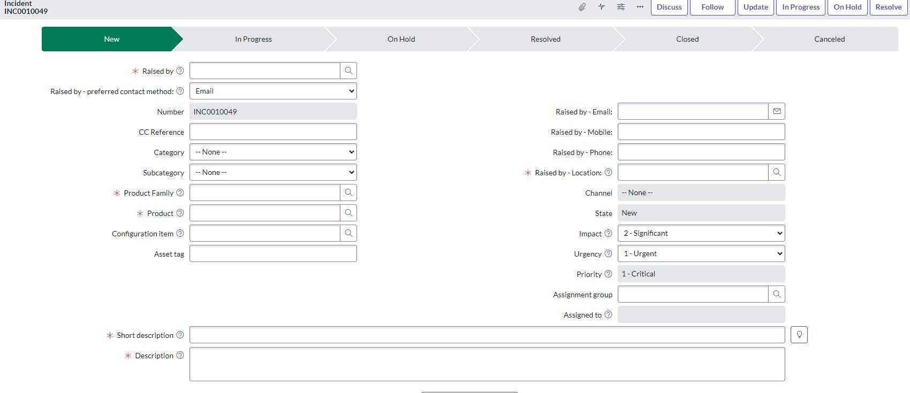
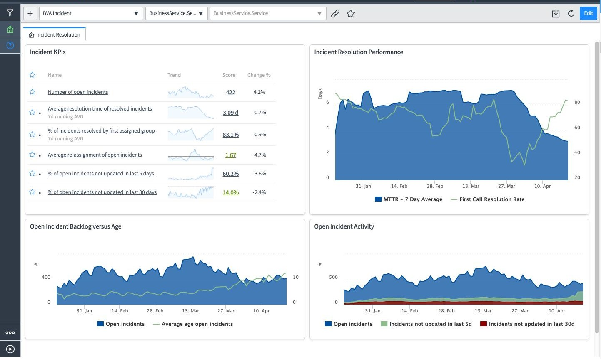
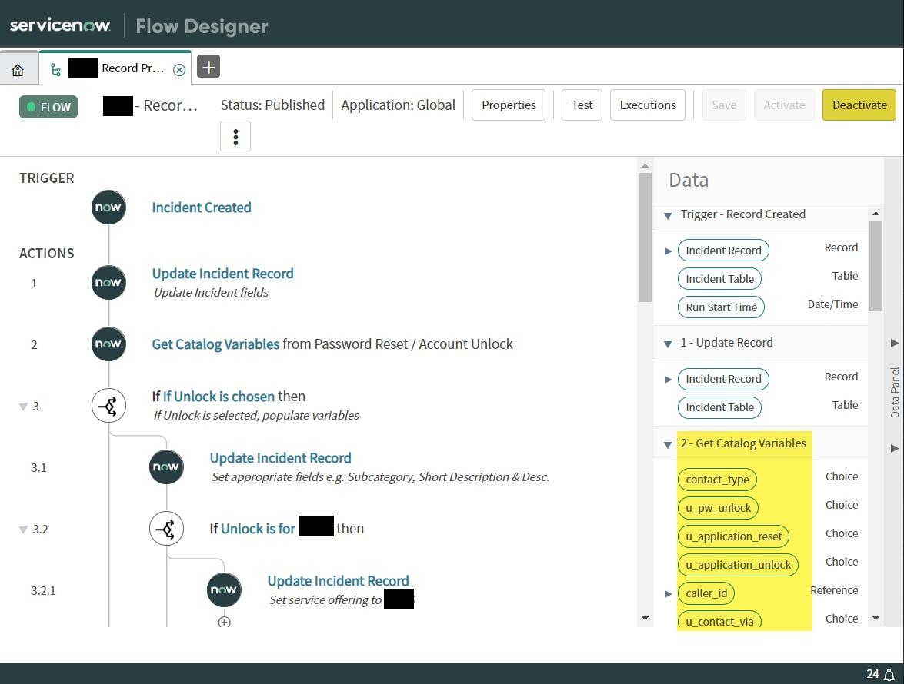
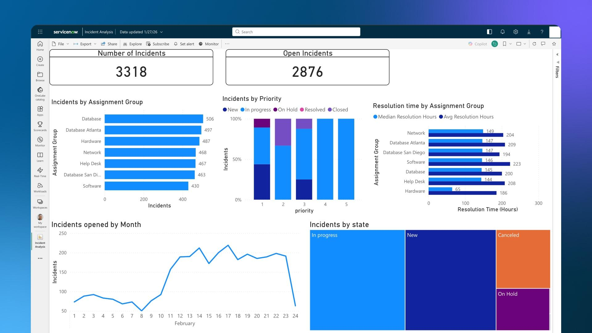

# Advanced ITSM & Incident Management System

## Overview

The Advanced ITSM & Incident Management System is a ServiceNow project focused on improving incident handling through structured incident management, automated assignment, workflow-based routing, and resolution tracking.

The system provides a centralized process for logging, categorizing, prioritizing, assigning, tracking, and resolving IT incidents.

## Reference Screenshots

The following reference visuals demonstrate key ServiceNow interfaces and workflow concepts associated with the project.


### 1. Incident Record



### 2. Incident Resolution Dashboard



### 3. Incident Flow Designer



### 4. Incident Analysis Dashboard




## Workflow

Incident Reported
→ Categorization
→ Priority Assessment
→ Assignment
→ Investigation
→ Resolution
→ Closure

## Key Features

- Centralized incident creation and tracking
- Incident categorization and prioritization
- Automated assignment and routing
- Priority-based workflow automation
- Incident status tracking
- Work notes and activity history
- Resolution and closure management
- Incident dashboard and reporting

## ServiceNow Technologies Used

- Incident Management
- Flow Designer
- ServiceNow ITSM
- Assignment Groups
- Incident Forms
- Business Rules
- Notifications
- Reporting and Dashboards
- Workflow Automation

## Incident Management Process

### 1. Incident Creation

Users can report IT issues by providing information such as:

- Short description
- Description
- Category
- Subcategory
- Impact
- Urgency

### 2. Categorization and Prioritization

The incident is categorized and assigned a priority based on the impact and urgency of the issue.

### 3. Automated Assignment

The workflow determines the appropriate assignment group and routes the incident to the relevant support team.

### 4. Investigation

The assigned technician investigates the issue and records updates through work notes and activity history.

### 5. Resolution

Once the underlying issue has been addressed, the technician records the resolution details and closes the incident.

## Project Architecture

```text
Incident Reported
       │
       ▼
Incident Created
       │
       ▼
Categorization & Priority
       │
       ▼
Flow Designer
       │
   ┌───┼────────┐
   ▼   ▼        ▼
Network  Email  Device
Team     Team   Team
   └───┬────────┘
       ▼
Incident Investigation
       │
       ▼
Resolution
       │
       ▼
Incident Closed
```

## Portfolio Note

The interface visuals included in this repository are reference visuals created or selected to represent the project's workflow and functionality. They are not screenshots exported from a currently active ServiceNow instance.

## What I Learned

This project provided practical experience with ITSM incident management, workflow automation, incident routing, assignment groups, prioritization, resolution tracking, and ServiceNow process automation.

